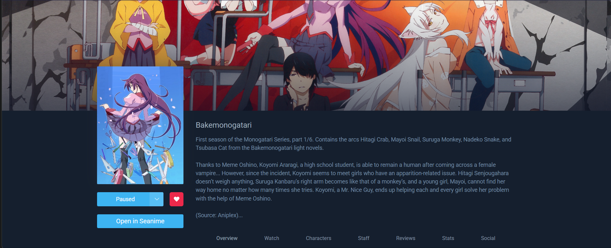

# Open in Seanime

A Chrome/Edge extension that adds a native **"Open in Seanime"** button to MyAnimeList and AniList anime pages.


## Preview

| MyAnimeList | AniList |
|-------------|---------|
|  |  |

## Features

- 🔗 **One-click access** — Open any anime directly in your local Seanime instance
- 🔄 **Automatic ID conversion** — Converts MAL IDs to AniList IDs using the AniList GraphQL API
- 🌐 **Multi-site support** — Works on both MyAnimeList and AniList
- 🎨 **Native integration** — Button styling matches each site's theme seamlessly
- ⚙️ **Configurable** — Customize your Seanime URL and port in the options page

## Installation

### From Source (Developer Mode)

1. Download or clone this repository
2. Open Chrome/Edge and navigate to `chrome://extensions`
3. Enable **Developer mode** (toggle in top-right corner)
4. Click **Load unpacked**
5. Select the `Open in Seanime` folder

### From Release

1. Download the latest `open-in-seanime.zip` from [Releases](../../releases)
2. Extract the zip file
3. Follow steps 2-5 above

## Configuration

1. Right-click the extension icon → **Options** (or go to `chrome://extensions` → Open in Seanime → Details → Extension options)
2. Set your Seanime URL (default: `http://127.0.0.1`)
3. Set your Seanime Port (default: `43211`)
4. Click **Save Settings**

## Usage

1. Navigate to any anime page on:
   - MyAnimeList: `https://myanimelist.net/anime/...`
   - AniList: `https://anilist.co/anime/...`
2. Look for the **"Open in Seanime"** button in the sidebar
3. Click to open the anime in your Seanime instance

## How It Works

```
MAL Page → Extract MAL ID → Query AniList API → Get AniList ID → Open Seanime
AniList Page → Extract AniList ID directly → Open Seanime
```

## Credits

- Inspired by [Stremio Movie Search](https://github.com/AliSultan00/Stremio-Movie-Search)
- Button placement logic adapted from [Nyaa Linker](https://github.com/po5/nyaa-linker)
- Built for use with [Seanime](https://seanime.rahim.app/)

## License

MIT License - see [LICENSE](LICENSE) file for details.
